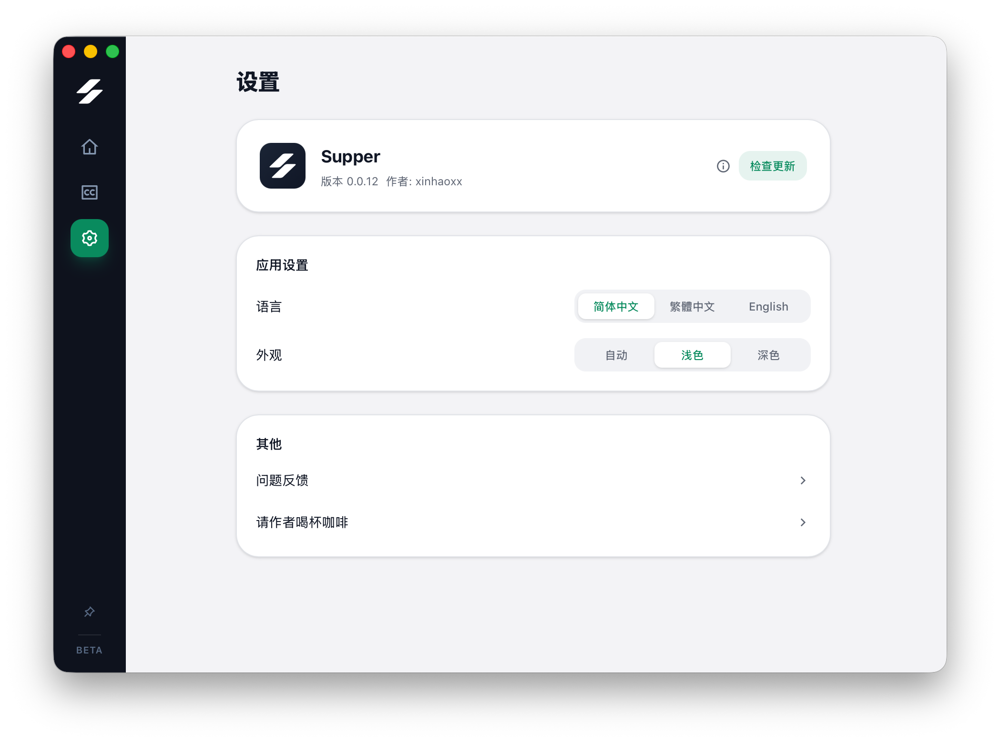
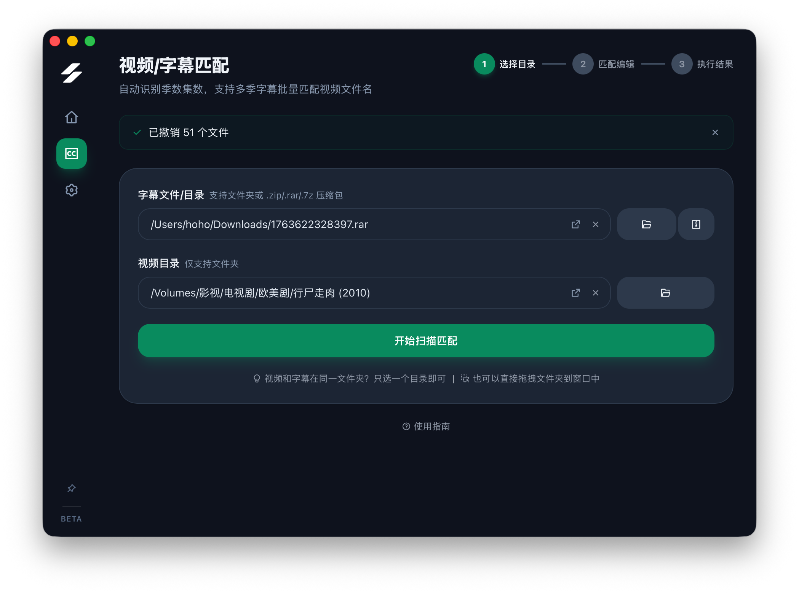

  <picture>
    <source srcset="app-icon-white.svg" media="(prefers-color-scheme: dark)" />
    
  </picture>

<h1 align="center">Supper</h1>

[中文](README.md) | English

> Video-subtitle matching · Batch rename · Fully offline

A desktop tool for batch renaming subtitle files. Automatically detects season and episode numbers from filenames and folder names, supports recursive multi-season scanning and archive extraction, matches subtitles to videos, and renames them so your media player can auto-load subtitles.

## Download

Download the latest version for your platform from the [Releases](https://github.com/xinhaoxx/supper-releases/releases) page.

- **macOS**: Download `.dmg` (ARM64, also works on Intel)
- **Windows**: Download `.msi` installer

## Features

### Core Workflow

1. **Select directory or archive** — Browse/drag subtitle folders or .zip/.rar/.7z archives, select video folder
2. **Auto scan & match** — Recursively scan subfolders, detect season & episode numbers, match automatically
3. **Review & rename** — View results grouped by season, edit filenames, batch rename or copy-rename

### Highlights

- **Multi-season matching** — Supports S01/S02, Season 1/Season 2 folder structures with recursive scanning
- **Season grouping** — Results grouped by season with collapsible sections
- **Archive support** — Subtitle source supports .zip/.rar/.7z, nested archives auto-extracted recursively
- **Season conflict detection** — Alerts when multiple folders resolve to the same season number
- **Folder name inference** — Extracts season from folder names (S01, Season 1, etc.) when filenames lack season info
- **Copy & rename** — Copy subtitles to video folder before renaming, preserving originals
- **Dark mode** — Auto / Light / Dark appearance modes

### Supported Episode Formats

- `S01E02`, `S01-E02`, `S01.E02`
- `1x02`, `01x02`
- `Season 01 Episode 02`
- Chinese episode markers like `第1集`, `第一集` (including Chinese numerals)
- `EP01`, `E01`
- Plain numbers: `1.srt`, `01.ass`
- Bracketed numbers: `[01].srt`

### Supported File Types

**Video**: `.mkv` `.mp4` `.avi` `.mov` `.wmv` `.flv` `.webm` `.m4v` `.mpg` `.mpeg` `.ts` `.m2ts`

**Subtitle**: `.srt` `.ass` `.ssa` `.vtt` `.sub` `.idx` `.sup`

**Archive**: `.zip` `.rar` `.7z`

### More Features

- Per-item checkboxes to select which files to rename
- Manual matching for unmatched subtitles
- Search filter for matched list
- Single-line / multi-line editing modes
- Rescan preserves edited filenames and checkbox states
- One-click undo with batch rollback
- UI in Simplified Chinese, Traditional Chinese, and English
- Built-in update checker

## Screenshots

  
   Home page

  
   Drag & drop or browse to select directories, supports archives

  
   Recursive scan, auto-detect seasons & episodes

  
   Review results grouped by season, edit target filenames

  
   Rename complete with undo and details

  
   Language / appearance switcher, check for updates

  
   Match editing interface in dark mode

## Feedback

Found an issue or have a suggestion? Please submit it on the [Issues](https://github.com/xinhaoxx/supper-releases/issues) page.
