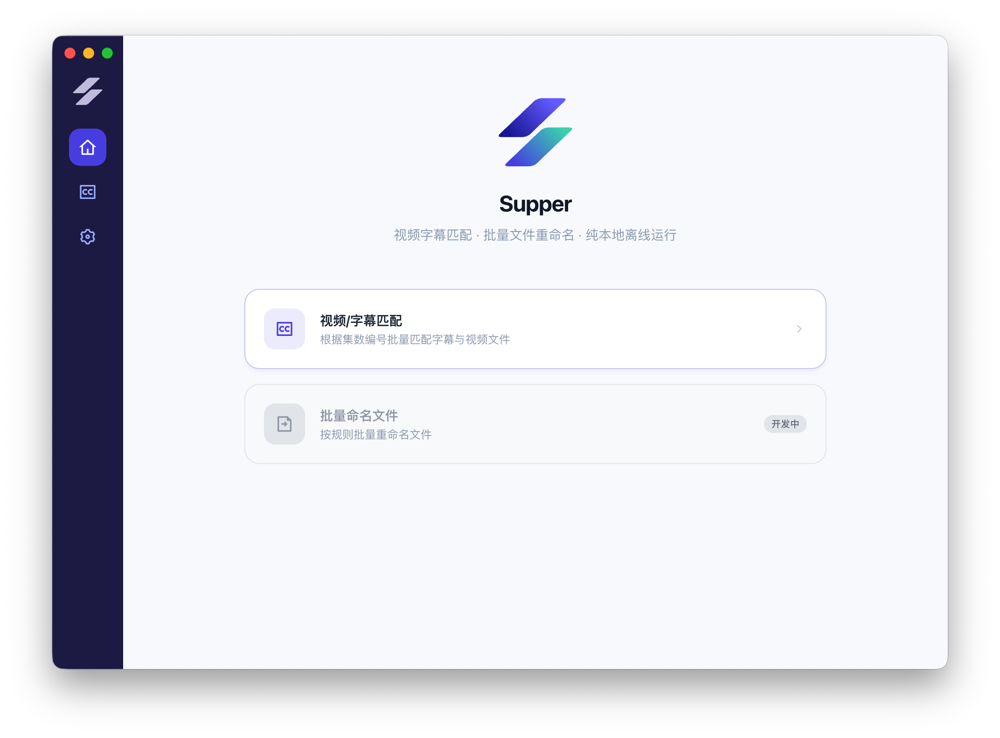
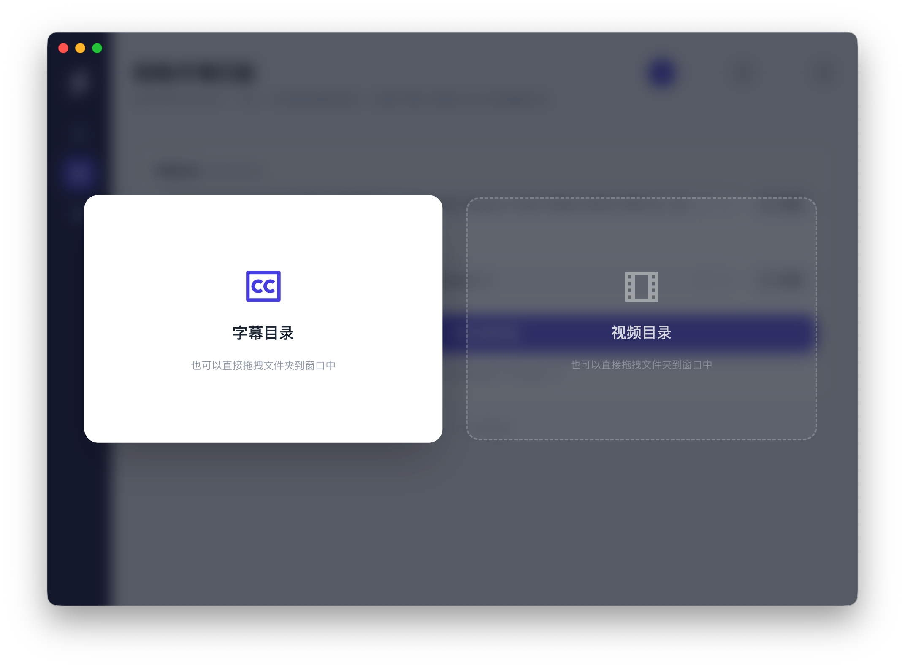
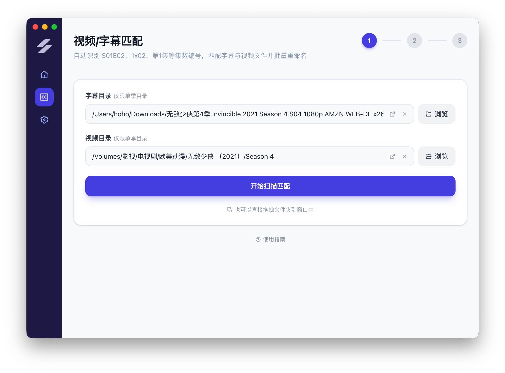
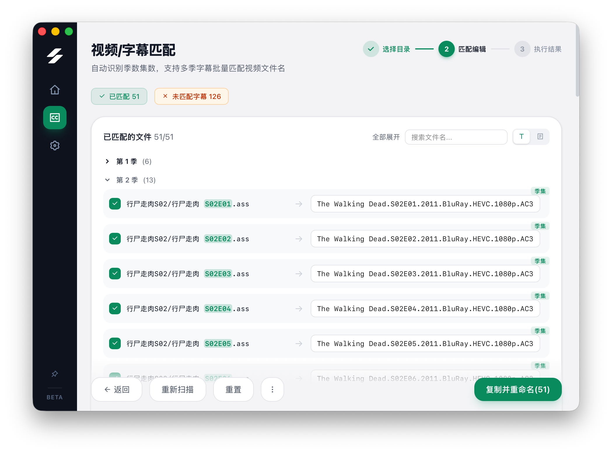
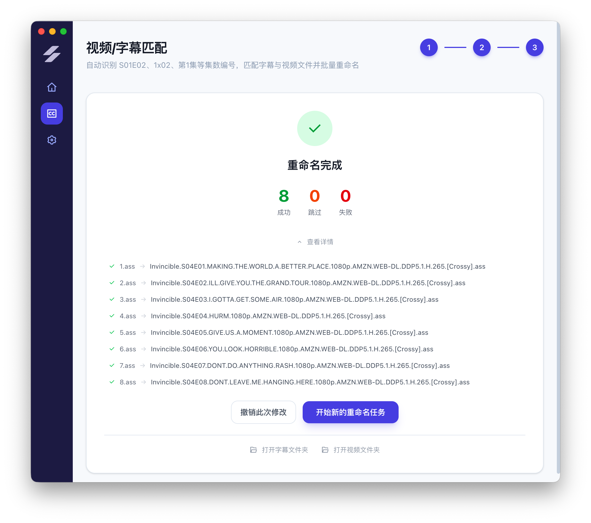

  

<h1 align="center">Supper</h1>

[中文](README.md) | English

> Video-subtitle matching · Batch rename · Fully offline

A desktop tool for batch renaming subtitle files. Automatically detects episode numbers in filenames, matches subtitles to corresponding videos, and renames them so your media player can auto-load subtitles.

## Download

Download the latest version for your platform from the [Releases](https://github.com/xinhaoxx/supper-releases/releases) page.

- **macOS**: Download `.dmg` or `.zip`
- **Windows**: Download `.exe` installer

## Features

1. **Select directories** — Browse or drag-and-drop subtitle/video folders
2. **Auto match** — Detects episode numbers (S01E02, 1x02, E01, etc.) and matches automatically
3. **Confirm rename** — Review results, edit target filenames, batch rename with one click

### Supported Episode Formats

- `S01E02`, `S01-E02`, `S01.E02`
- `1x02`, `01x02`
- `Season 01 Episode 02`
- Chinese episode markers like `第1集`, `第一集` (including Chinese numerals)
- `EP01`, `E01`
- Plain numbers: `1.srt`, `01.ass`
- Bracketed numbers: `[01].srt`

### Supported File Types

**Video**: `.mkv` `.mp4` `.avi` `.mov` `.wmv` `.flv` `.webm` `.m4v` `.mpg` `.mpeg` `.ts` `.m2ts`

**Subtitle**: `.srt` `.ass` `.ssa` `.vtt` `.sub` `.idx` `.sup`

### More Features

- Per-item checkboxes to select which files to rename
- Manual matching for subtitles that couldn't be auto-matched
- Rescan preserves edited filenames and checkbox states
- One-click undo after rename
- UI in Simplified Chinese, Traditional Chinese, and English
- Built-in update checker

## Screenshots

  
   Home page

  
   Drag and drop subtitle and video folders

  
   Auto-detect episode numbers and match

  
   Review matches and edit target filenames

  
   Rename complete with undo and details

## Feedback

Found an issue or have a suggestion? Please submit it on the [Issues](https://github.com/xinhaoxx/supper-releases/issues) page.
